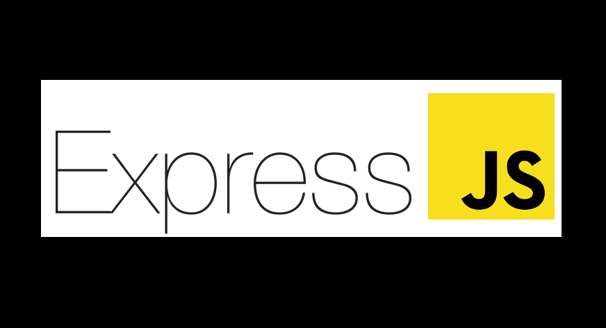
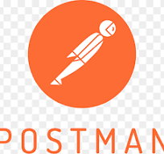
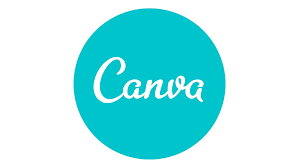

<h1 align="center">Hi there! 👋, I'm Rajeev Dangwal</h1>
<h3 align="center">Passionate MERN Stack Developer from India</h3>

<strong>MERN Stack Developer | Professional in building dynamic web pages using Framer Motion</strong>

  

- 🌱 I’m currently learning **Next.js**

- 💬 Ask me about **React, Node.js, MongoDB, Express.js**

<h3 align="left">Connect with me:</h3>

  &nbsp; &nbsp; &nbsp;  &nbsp; &nbsp; &nbsp; &nbsp;
   &nbsp; &nbsp; &nbsp; &nbsp;
   
   &nbsp; &nbsp; &nbsp; &nbsp;
   

<h3 align="left">Languages and Tools:</h3>

   
  
  
  
  
  
  
  
  
  
  
  
  
  
  
  
  
  

<!-- Updated GitHub Languages Chart -->

  

### Projects:

- **Portfolio : React | Tailwind CSS | Framer Motion**
  
  - A personal portfolio website built using **React, Tailwind CSS, and Framer Motion**. This portfolio showcases my skills, projects, and experience with smooth animations and a modern responsive design.
  <a href="https://rdportfolio-olive.vercel.app/" target="_blank">View Project</a>

- **Todofy : React | Tailwind | Node | Express | MongoDB**
  
  - Todofy is a full-stack MERN (MongoDB, Express.js, React, Node.js) To-Do application that allows users to create, edit, and manage their daily tasks efficiently. It features authentication using JWT, real-time updates, and a user-friendly interface for a seamless task management experience.
  <a href="https://github.com/Rajeev5842/todofy" target="_blank">View Project</a>

- **XCrypto : Reactjs | ChakraUI | CoinGeko API**
  
  - XCrypto is a responsive web application built using React and Chakra UI. It leverages the CoinGecko API to fetch real-time information about various cryptocurrencies, providing users with up-to-date data on market prices, trends, and more.
  <a href="https://react-crypto-app-lovat-three.vercel.app/" target="_blank">View Project</a>

### 📢 Available for Freelance Projects

I am open to collaboration and freelance projects! If you need a **dynamic, responsive, and engaging web application**, feel free to reach out. Let's build something amazing together! 🚀

### 🌟 Keep Learning, Keep Building

Passionate about coding, always eager to learn new technologies, and dedicated to crafting high-quality web applications. Let's innovate and grow together! 💡✨

### ❤️ Code, Create, Inspire

Coding isn't just about writing lines of code; it's about **creating experiences, solving problems, and inspiring others**. Let's keep pushing boundaries and making the web a better place!
